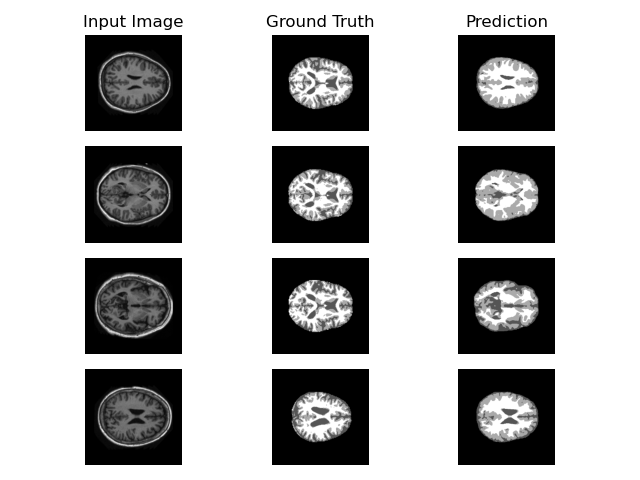
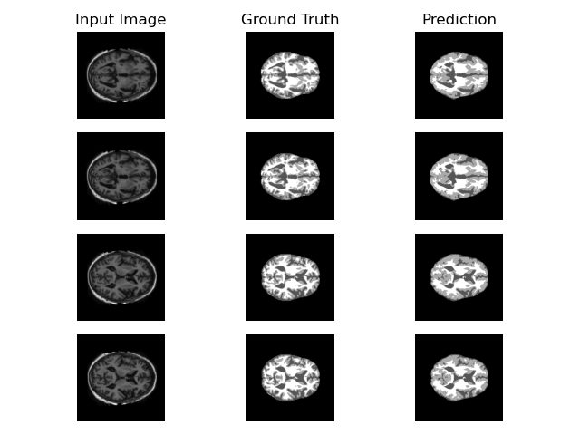
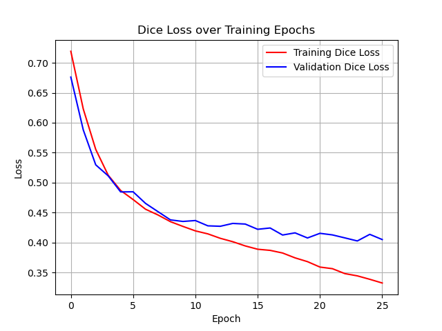
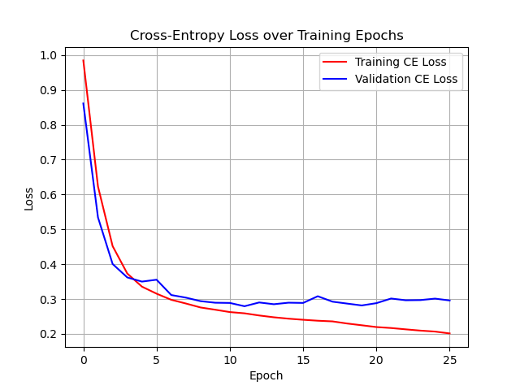

# 2D OASIS brain data segmentation with Improved UNet

## Project Synopsis

This project segments raw 2D brain MRI data slices into regions of distinct classification. 
Using an improved UNet model, success criteria consisted of achieving a dice similarity coefficient of 0.9 minimum across the final predictions.\
Each 2D data slice is segmented into 4 classes, distinguished by equally distributed greyscale shades in the segmentation mask:

1. Background (black)
2. Cerebro-spinal fluid (dark grey)
3. Grey matter (light grey)
4. White matter (white)

For example:




## Model Analysis

### UNet Model

The Improved UNet algorithm proves to be a reliable model architecture for 2D image segmentation tasks, particularly those of medical application. 
In summary, it's design revolves around applying numerous fine filters over the image to discern patterns across the image. 
These filters are applied repeatedly over several layers, between which the data is compressed, yielding a smaller result each time.
This act of compression - called pooling - allows for the algorithm to capture elements of both fine detail and abstract patterns across the data.
Finally, the data is upscaled back through each layer, where each layer of prediction is compiled presenting a final mask that matches the resolution of the input image.
This method of compaction to a final bottleneck and contrasting reconstruction presents the U-shape architecture that entitles the UNet.

### Dataset

This model is trained on the pre-split OASIS dataset. Training comprised 9664 slices, validation over 1120 validation slices, and final evaluation on 544 testing slices.
This achieves a distribution approximating 85 / 10 / 5 respectively, aligning with the train-heavier side of typical split ratios.

The dataset consistutes 256x256 greyscale (single channel) images. Loading of each dataset consisted of:

- Sequentially pairing each slice with their respective mask
- Applying z-score normalization to each slice, minimising instability in training values
- Decoding the masks from greyscale values to class-label identifiers (integers 0 - 3)

Such processing was computed on-the-fly, as data was requested by the model. 
This increases the training time, as data was processed repeatedly upon each epoch, in favour of optimising the memory demands.

### Model Operation

Training consisted of 26 epochs and batches of 4 images, with validation tests occurring after each epoch. 
Model evaluation utilised a combination of Dice loss coefficient and cross entropy loss methods calculated at each epoch, however testing was governed by cross entropy loss.
Train the model using:
```
python3 train.py
```
Each epoch loss will be displayed, and the model state and training losses are saved to disk (model: `_tdmodel/model.dat`; losses: `_tdmodel/loss.dat`).\
Snapshots of the predictions throughout training are also saved locally (`_tdmodel/disp/`)

### Model Evaluation

After training, evaluate the model using:
```
python3 predict.py
```
This will load the saved model and test it using the yet unseen test dataset. 
Its final result is displayed in output and the visualisation of predictions in the first batch is saved to disk.\
For example:



This module will also model the loss results from training and validation (`_tdmodel/plot/`).\
For example:


## Model Results

The final result of this model achieved a loss score of **0.29355** and dice score of **0.59782**. 

> Training loss scores continued to decrease with each epoch, reaching a minimum of **0.20137**, while validation scores converged towards, approximately, **0.29**.

> Similarly, training dice scores show decline across epochs, reaching **0.66733**, validation scores converged about **0.6**

While it is likely possible to reach a convergence of training loss scores, given more epochs, this would only result in model overfitting, as the validation scores had already reached their convergence points.\
The resulting output is:

```
Starting model training on cuda
	[ Epoch 1 / 26 ]	Train: L=0.98436 D=0.71914	Validate: L=0.86103 D=0.67615
	[ Epoch 2 / 26 ]	Train: L=0.62303 D=0.62290	Validate: L=0.53432 D=0.58800
	[ Epoch 3 / 26 ]	Train: L=0.45187 D=0.55552	Validate: L=0.40059 D=0.52977
	[ Epoch 4 / 26 ]	Train: L=0.37325 D=0.51251	Validate: L=0.36206 D=0.51142
	[ Epoch 5 / 26 ]	Train: L=0.33565 D=0.48701	Validate: L=0.35009 D=0.48460
	[ Epoch 6 / 26 ]	Train: L=0.31543 D=0.47188	Validate: L=0.35551 D=0.48481
	[ Epoch 7 / 26 ]	Train: L=0.29792 D=0.45573	Validate: L=0.31159 D=0.46544
	[ Epoch 8 / 26 ]	Train: L=0.28726 D=0.44615	Validate: L=0.30409 D=0.45165
	[ Epoch 9 / 26 ]	Train: L=0.27587 D=0.43496	Validate: L=0.29401 D=0.43792
	[ Epoch 10 / 26 ]	Train: L=0.26944 D=0.42707	Validate: L=0.28949 D=0.43535
	[ Epoch 11 / 26 ]	Train: L=0.26269 D=0.41961	Validate: L=0.28887 D=0.43687
	[ Epoch 12 / 26 ]	Train: L=0.25914 D=0.41463	Validate: L=0.27945 D=0.42804
	[ Epoch 13 / 26 ]	Train: L=0.25293 D=0.40722	Validate: L=0.29024 D=0.42730
	[ Epoch 14 / 26 ]	Train: L=0.24776 D=0.40157	Validate: L=0.28522 D=0.43205
	[ Epoch 15 / 26 ]	Train: L=0.24375 D=0.39455	Validate: L=0.28957 D=0.43101
	[ Epoch 16 / 26 ]	Train: L=0.24061 D=0.38900	Validate: L=0.28890 D=0.42225
	[ Epoch 17 / 26 ]	Train: L=0.23789 D=0.38711	Validate: L=0.30815 D=0.42445
	[ Epoch 18 / 26 ]	Train: L=0.23599 D=0.38272	Validate: L=0.29255 D=0.41271
	[ Epoch 19 / 26 ]	Train: L=0.22989 D=0.37462	Validate: L=0.28706 D=0.41631
	[ Epoch 20 / 26 ]	Train: L=0.22484 D=0.36830	Validate: L=0.28170 D=0.40779
	[ Epoch 21 / 26 ]	Train: L=0.21971 D=0.35926	Validate: L=0.28826 D=0.41555
	[ Epoch 22 / 26 ]	Train: L=0.21698 D=0.35655	Validate: L=0.30154 D=0.41290
	[ Epoch 23 / 26 ]	Train: L=0.21315 D=0.34834	Validate: L=0.29658 D=0.40792
	[ Epoch 24 / 26 ]	Train: L=0.20954 D=0.34459	Validate: L=0.29707 D=0.40281
	[ Epoch 25 / 26 ]	Train: L=0.20679 D=0.33885	Validate: L=0.30125 D=0.41382
	[ Epoch 26 / 26 ]	Train: L=0.20137 D=0.33267	Validate: L=0.29598 D=0.40516
Training complete!
```
```
Starting model evaluation
	[ Eval ]	Validate: L=0.29355 D=0.40218
Evaluation complete!
```

Yielding the loss plots:






## Dependencies

- `python : 3.9.23`
- `pytorch : 2.5.1`
- `numpy : 2.0.1`
- `pillow : 11.3.0`
- `matplotlib : 3.9.2`